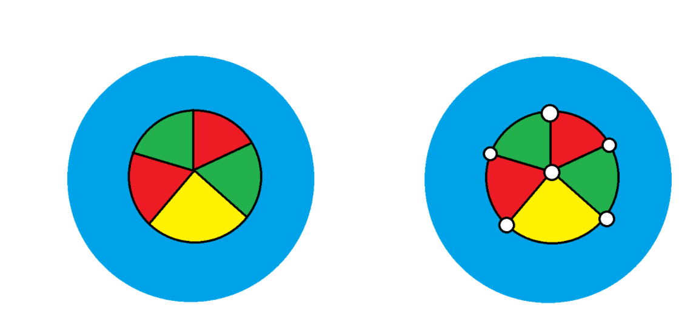

# 引言

在[图论基础概念略解](https://zhuanlan.zhihu.com/p/1990379940319875970)中我们没证明这个定理，因为怕太长打断了。

不过现在我们可以证明了。

我查了，绝大部分中文笔记会略过四色定理的证明，或者只介绍证明思想与计算机证明的框架，不再给出细节。不过这正好给了我水一篇文章的理由。早知道就把 Brooks 定理的证明单开一篇文章。

与之前的某些定理不同，四色定理的证明历史不像是一个先给出证明然后逐步更新化简的过程，而更像是一条逐步发展的线，每一步沿着之前的脉络行进，并在艰难地到达彼岸后逐步发展；本文的讲述应当遵循这一过程。

# 四色定理的表述

> **定义（平面图）**
>
> 一个图是平面图当且仅当它可以被边不交叉地画在平面上。

> **定义（平面嵌入）**
>
> 把一个平面图边不交叉地画在平面上，这种画法称作该平面图的平面嵌入。

> **定义（合法面染色）**
>
> 对平面图的平面嵌入的每个面（包括最外围的无限大区域，即外部面）进行染色，使得相邻两个面颜色不同，则称其为该平面嵌入的合法面染色。

如果两个面仅在对角线处相碰，如下图，它们不被视为相邻，此时它们也可以染成同一种颜色。

> **定义（面色数）**
>
> 一个平面图的平面嵌入的合法面染色需要用到的最少颜色数，称为该平面嵌入的面色数。

> **定理（四色定理）**
>
> 任何一个平面图的平面嵌入的面色数不超过 4。

如图，转化为图结构的面染色是四色定理从地图染色中最直接的第一步抽象，其中蓝色面是外部面，也算入，尽管你染地图的时候可能不需要染外部面，但这不影响结论，因为不染外部面，色数不会更多

# 证明思路概述

四色定理的完整证明是一个极其复杂的过程，所以我们必须谨慎地进行内容划分。

我在之前的 Kuratowski 定理中连着写了一大段，但在写这个的时候，如果再这样操作，连我自己都感觉对这个问题的复杂性不够尊重，所以不妨写开。

四色定理的证明我们分为九个部分：

第一部分我们做点最最基础的转化，简单来说，我们用平面图几何对偶，把面染色转变为点染色的问题，然后加边，把图变成极大平面图。这样，我们的研究框架就被限定在极大平面图的点染色数上了，方便我们研究。

第二部分我们利用平面图的欧拉公式搞一搞，证明如果存在不能被 4 染色的平面图反例，则必定包含度数为 1、2、3、4、5 的顶点之一，这个“必定”的说法有点意思，我们会把它简单形式化成“不可避免集”的概念。

第三部分我们引入可约构型的概念，简单来说，含有可约构型的图一定不是最小反例，并证明度为 1、2、3、4 的顶点是可约构型。

第四部分我们展示度数为 5 的顶点为何没有被简单地证明为可约构型，这一部分逻辑量其实不小，因为 Kempe 曾经做过一段非常高明的伪证，我们需要展示它错哪了，这可是四色定理的两大著名伪证之一，同样，我们也会简单介绍 Tait 的论文，Tait 的心态相比 Kempe 而言更加微妙，不过不论如何，他终究是做出了自己的贡献。

第五部分介绍以 Birkhoff 为主导的进一步连通性归约，其重点在于，在极大平面图的基础上，证明了比 Kempe 更强的结论，即大小为 3、4、5 的分离圈在绝大部分情况下的可约性，并将求解范围进一步收缩到“内部 6 连通的极大平面图”（internally 6-connected triangulation）这一类十分特殊的构型之中（你可能知道平面图的点连通度不超过 5，但是内部 6 连通是一个专有名词，它的意思是图的连通度为 5，且不存在非平凡的 5-点割集），我们同样会介绍这种相对密集的平面图的特殊性质。

第六部分介绍可约性判定，可约性判定其实是一个计算极度密集的任务，研究者们在可约构型的研究中总结了一个有趣的规律，稍大一点的构型，反而会比较高概率是容易证明可约性的，此外我们会讲解一个相对有趣的，枚举复杂度与证明准确性的权衡的问题。

第七部分介绍放电法，简单来说，一个很自然的思路是，我们稍微在不可避免集中用大一点的构型，显然，这会导致不可避免集元素数量大增，如何按照特定的要求找到这样的不可避免集呢，我们的确应该采用放电法的框架。

第八部分即结合放电法和可约性判定，讲述一个完整的证明过程，包括规则的挑选策略，以及证明本身的复杂性，它绝非一个写一次代码然后生成就能搞定的东西，其背后包含着复杂的数学直觉以及极度繁琐的人机交互过程。

第九部分介绍基于微内核的交互式证明器，我们为什么可以相信一个长到我们都看不出来有多长的证明，其原因就在于此，经过了它，四色定理才终于算是“被证明”了。

我们会引用在[图论基础概念略解](https://zhuanlan.zhihu.com/p/1990379940319875970)和 [Kuratowski 定理的基础证明](https://zhuanlan.zhihu.com/p/1994893756747515716)中已经讲述过如何证明的基础定理，也就是说，我们不会重新介绍：

[图论基础概念略解](https://zhuanlan.zhihu.com/p/1990379940319875970)中讲解过的：

- 平面图的面的定义
- 平面图的几何对偶
- 平面图的欧拉公式
- 图的度数的定义
- 导出子图的定义
- 点割集的定义
- 正则图的定义
- 点连通度的定义

[Kuratowski 定理的基础证明](https://zhuanlan.zhihu.com/p/1994893756747515716)中讲解过的：

- 2-连通平面图的面的边界是个圈
- $K_{3,3}$ 不是平面图

在整个讲解过程中，我们仍然不会引入严格的拓扑定义，在此时可以将它们当作公理使用：

- 一条闭合曲线将平面分为内部和外部

特别说明，本文仅仅需要用到这两篇文章非常非常少的知识，因此不需要提前完整阅读这两篇，而且用到的知识已经明确列出，因此可以自查，虽然较为繁杂，但阅读门槛仍然相当低。

