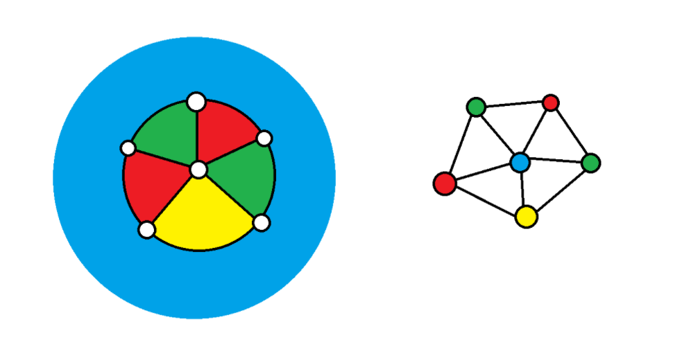
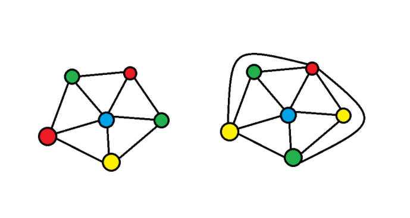
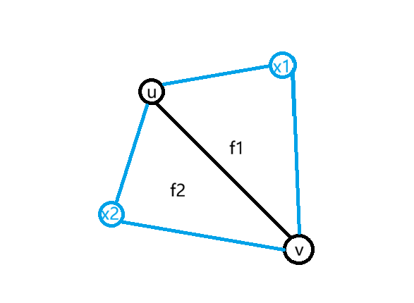
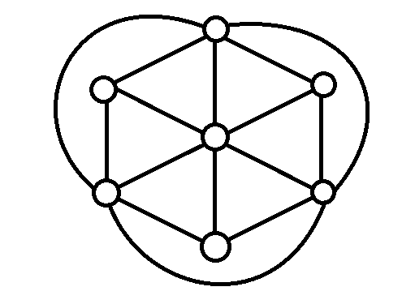

# 基础转化

拓扑性质常常非常复杂，因此我们会喜欢把它转化成结构性质。

## 几何对偶转点色数

通过几何对偶，我们可以进行第一步转换，几何对偶的规则实际上非常简单，它在地图的每个区域（包括外部面）的中心放置一个顶点，如果两个区域相邻，则在对应的顶点处连一条边。经过这样的转换，地图的面染色问题就被转换成了其对偶图的点染色问题。

平面图的对偶图仍然是平面图，因此，我们现在要证明的即是：

> **定理（四色定理，点染色形式）**
>
> 平面图的点色数不超过 4。

如图，左图是对平面图的面染色，右图是其对偶图的点染色，两者等价

显然，重边不影响色数，所以可以直接去掉重边，因此我们只需要考虑一个简单平面图。

显然，如果平面图不连通，只需要考虑色数最多的那个连通分量，因此我们只需要考虑简单连通平面图。

## 加边得到极大平面图

接下来，我们考虑让我们研究的对象窄化一点，考虑这样一个事实：

> **定义（极大平面图）**
>
> 如果一个简单平面图的面的边缘存在两个不直接相连的顶点，那么把它们直接相连，点色数不会减小。持续操作直到无法再操作为止，得到的图称为**极大平面图**。

显然，我们这里定义的极大平面图必须是简单图。

那么我们要证明的就是：

> **定理（四色定理，极大平面图形式）**
>
> 极大平面图的点色数不超过 4。

如图，左图是原来的图，它的外部面是五边形，右图是通过加边之后的极大平面图，而且色数同样是 4（尽管原来的染色策略失效了）

## 极大平面图的面是三角形

> **定理（极大平面图的面是三角形）**
>
> 如果图的点数 $n\ge 3$ ，则极大平面图的每一个面都是三角形，也就是说，设点数为 $n$ ，边数为 $e$ ，面数为 $f$，我们总有 $2e=3f$ ，即所有边的两侧在数学意义上等价于所有面的每一侧。

这个性质非常好，我们很快就会看到，由于点数小于 3 的情况过于平凡，且容易给出平面嵌入，所以我们后续只考虑点数不小于 3 的极大平面图，有的时候，我们也会直接称其为极大平面图。

**证明：**

很好，那么为什么极大平面图的每一个面都是三角形呢？

这是因为极大平面图一定是 2-连通的。

极大平面图不可能是不连通的，因为如果它存在多个连通分量，那么任取一个平面嵌入，一定存在一个面，它的边缘来自不同的连通分量，从上面任取两个来自不同分量的点可以连接。

极大平面图不可能是 1-连通的，因为它的点数不小于 3 的时候，一定有割点，把这个极大平面图画出来，割点一定连着若干个顶点，取顺时针相邻的两个顶点即可连边。

所以极大平面图至少是 2-连通图，由于我们在 [Kuratowski 定理的基础证明](https://zhuanlan.zhihu.com/p/1994893756747515716)中利用耳分解证明了 2-连通平面图的每个面的边界一定是个圈，所以它的面一定是多边形。

对于边数大于 3 的多边形面，一定存在两个点没有直接连边，因此可以在平面嵌入中直接新连上。

因此，极大平面图的每个面都是三角形，所有边的两侧在数学意义上等价于所有面的每一侧，推导可得 $2e=3f$ 。$\blacksquare$

我证明它不是因为它有多难，而是，如果你在拓扑上偷懒，你就有可能忽略细节上的情况。

## 极大平面图的其它性质

显然，四色定理如果存在反例，顶点数必定大于 4。

考虑顶点数大于 3 的极大平面图，我们要证明它的两个性质，这两个性质能给我们信心，有助于我们解释归约方向的正确性：

> **定理（极大平面图的两种性质）**
>
> - 顶点数大于 3 的极大平面图，色数至少是 3。
> - 顶点数大于 3 的极大平面图，连通度至少是 3。

**证明：**

色数至少是 3 是显然的，我们已经证明了它的每个面都是三角形，任取它面上的三个顶点，作为一个三元环结构，色数恰好等于 3，那么整体的色数显然至少得是 3。

连通度至少是 3 则不那么显然，但是它的证明过程可以引出一个很好的性质，所以我们也给出证明。

具体而言，我们先证明一个引理：

> **引理（最小度数）**
>
> 顶点数大于 3 的极大连通图，其最小度数至少是 3。

**证明：**

这是因为考虑任何一条边 $(u,v)$ ，由于顶点数大于 2 的极大平面图是 2-连通的，它的每个面都是圈，为了满足条件，所以这条边的两侧一定属于不同的两个面，考虑设为 $f_1,f_2$ ，不妨设 $f_1$ 面上不属于 $\{u,v\}$ 的唯一一个顶点是 $x_1$ ， $f_2$ 面上不属于 $\{u,v\}$ 的唯一一个顶点是 $x_2$ 。

如果 $x_1=x_2$ ，则得到一个孤立的三角形，由于顶点数大于 2 的极大平面图是 2-连通的，所以这种情况不成立，此时， $u$ 至少连接 $x_1,v,x_2$ 三个顶点，而 $v$ 至少连接 $x_1,u,x_2$ 三个顶点，即证明了如果顶点的度数非零，那么顶点的度数至少为 3。

如图标明了 f1 f2 x1 x2，标明对于顶点数大于 3 的极大连通图，是如何逼出度数至少为 3 的性质的

又由于 2-连通图不存在度数为零的顶点，所以顶点数大于 3 的极大连通图，其最小度数至少是 3。$\blacksquare$

> **引理（邻居导出子图成圈）**
>
> 对于一个顶点数大于 3 的极大平面图，任取一个顶点，其相邻顶点的导出子图可以仅仅通过删边得到一个圈。

**证明：**

对于任意顶点 $u$ ，考虑其的一个嵌入中相邻顶点，按照顺时针的顺序分别标记为 $v_1,v_2,\cdots,v_n$ 。

其中，由于 $u,v_1$ 和 $u,v_2$ 连边，而且由于顺时针 $u,v_1,v_2$ 在同一个面的边界，而由于每个面的边界都是三角形，所以 $v_1,v_2$ 必然有连边。

同理得到整个环的连边关系，因此，任取一个顶点，其全体相邻顶点的导出子图可以仅仅通过删边得到一个圈。$\blacksquare$

如图直观展示了顶点数大于 3 的三连通图的每个顶点的全体相邻顶点的导出子图都可以通过删边得到圈的自然现象

> **定理（割点判定）**
>
> 一个图的顶点是割点，当且仅当删去了这个顶点后，存在原本和该顶点相邻的两个顶点不连通。

**证明：**

如果删去顶点的任意两个邻居连通，考虑原图上的任意两个（不是被删点的）顶点原本的点不重复的路，那么对于不经过被删点的路，显然保持，否则，如果经过了被删点，必定经过至少两个邻居，由于这两个邻居连通，立刻可以构造一条新的路径证明原本的两个顶点在新图中仍然连通。$\blacksquare$

考虑在极大平面图中删去一个顶点 $u$ ，由于它的边缘至少是个环，所以删去 $u$ 并没有造成与其直接相邻的两个顶点不连通，即原图仍然连通。

此时，如果再删去 $v$ ，由于 $v$ 相邻顶点也至少是一个环，如果 $u$ 不在环上，那么自然连通，就算在环上，删去一个顶点得到一条链，仍然是连通的，即 $v$ 不是删去 $u$ 的图的割点，而删去 $u$ 的图是连通图。

因此，顶点数大于 3 的极大平面图至少是 3-连通的。$\blacksquare$

