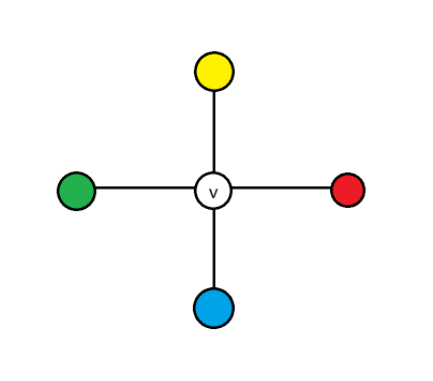
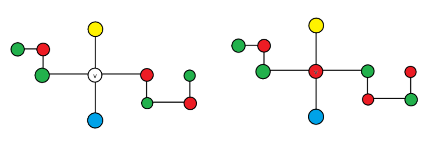
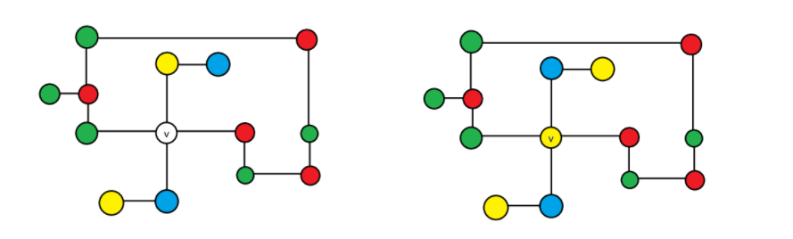

# 可约构型与双色链

这一切都要从我们证明四色定理的证明手段开始说起，考虑反证法证明四色定理。

如果四色定理不成立，那么一定存在一个平面图，它的点色数不小于 5。

那么，一定存在一个点数最少的平面图，它的点色数不小于 5。

## 可约构型

> **定义（可约构型）**
>
> 图集 $\mathcal G$ 上的一个**可约构型** $H$ 满足：对于任意满足 $H\sqsubseteq G$ 且 $G\in \mathcal G$ 的图，如果 $G$ 不能被 4 染色，我们可以通过某种手段证明存在一个更小的平面 $G_1$ ，满足它也不能被 4 染色。

（这样定义是因为我们会逐步窄化 $\mathcal G$ ，但是更小的例子 $G_1$ ，我们不需要它属于 $\mathcal G$ ）

那么，如果全体平面图的一个不可避免集 $S$ 中的每个构型都能够被证明是平面图上的可约构型，我们就证明了四色定理。

这里有一个不得不讲的细节，有没有感觉我们的可约构型的定义十分宽泛，“可以通过某种手段”证明，是的，而且从实际角度考虑，我们很难真正证明一个构型“不可约”。当我们说一个构型是可约构型时，实际上是在说，我们已经通过某种特殊手段证明了它可约。

证明可约的手段很难说能真正做到简单，但也绝不能太复杂，我们马上要接触的即是相对简单的一种方法。

## 度数为 1、2 或 3 的可约性

> **定理（可约性的局部判据）**
>
> 如果一个局部构型 $H=\{G_1,d^*\}$ 满足：对于任意平面图 $H\sqsubseteq G$ ，如果 $G$ 去掉一个这个构型的子图可被 4 染色，那么 $G$ （在平面图上）可约，则 $H$ 可约。

**证明：**

如果 $G$ 是最小反例，比它顶点更小的子图一定能被 4 染色，反过来就可以推出 $G$ 能被 4 染色。$\blacksquare$

> **定理（额外度数为 1、2、3 的顶点可约）**
>
> 以可约性的局部判据为基础，额外度数为 $1,2,3$  的顶点都是可约的。

**证明：**

考虑把它们染色，如果没有该局部构型的图已经成功四染色，那么加上这个顶点，它的相邻顶点个数不超过 3，也就意味着，4 种颜色一定至少有一种没有在它的相邻顶点中出现，那么就可以把这个顶点染色成没有出现的那种就行了。$\blacksquare$

## 度数为 4 的可约性

额外度数为 4 的顶点的可约性证明则需要用到平面图的性质，由 Alfred Bray Kempe 在 1879 年用双色链的技巧证明[2]（顺带一提，我见过的所有英文资料都将其描述为 Kempe 链，合理怀疑是因为 double color chain 比 Kempe chain 字母多，当然此处仅为调侃，我并不是说通用表述不好）。

顺带一提，如果你去读 Kempe 的原论文，你可能很难找到类似“双色链”这样的表述，因为 Kempe 是在平面图面染色的框架下完成的文章，当然，我会合理转述他的表述。

**证明：**

对于一个存在度数为 4 的顶点 $v$ 的平面图 $G$ ，如果 $G$ 去掉这个度数为 4 的顶点 $v$ 就能完成 4 染色，那么不妨把 $G$ 画在平面上，然后我们用 4 种颜色对除了 $v$ 以外的顶点染色。

现在考虑 $v$ 的相邻顶点，如果 $v$ 的邻居有重复的颜色，那么至多出现 3 种颜色的顶点与 $v$ 相邻，同样的，可以把 $v$ 染色成为没出现的那种颜色。

否则， $v$ 的 4 个“好”邻居颜色不重复，占满了 4 种，那么不妨假设四个顶点按照逆时针顺序分别染色成了红黄绿蓝四色。

如图是展示 v 四周的顶点染色情况，即按照逆时针顺序染成了红黄绿蓝四色

考虑当前染色，不妨提取出 $G$ 中由染成红色的顶点和染成绿色顶点组成的导出子图（注意到其中任意一条路径都是红绿两色交替了嘛），如果 $v$ 的红色邻居和绿色邻居在导出子图中不连通；则可以对 $v$ 的红色邻居在导出子图的连通块内的全体顶点红绿反色，然后再把 $v$ 染成红色，显然这样仍然是一个合法的染色方案。

如图是展示 v 的红色邻居和 v 的绿色邻居在红绿双色导出子图中不在同一个连通块的情况，此时红邻居所在的连通块红绿反色，染色方案仍合法，且让 v 邻居空出红色

否则，由于连通，一定存在一条红绿双色链，端点恰好是 $v$ 的红色邻居和绿色邻居，这条双色链从拓扑上将整个平面划分为了两个区域， $v$ 的黄色邻居和蓝色邻居分别位于这两个区域内部。

因此，不妨提取出 $G$ 中由染成黄色的顶点和染成蓝色顶点组成的导出子图，由于那条红绿双色链，我们可以断言， $v$ 的黄色邻居和蓝色邻居在导出子图中不连通。

因此可以对 $v$ 的黄色邻居在导出子图的连通块内的全体顶点黄蓝反色，并把 $v$ 染成黄色，这同样是一个合法的染色方案。

如图展示的是由于红绿双色链的存在， v 的黄色邻居和 v 的蓝色邻居在红绿双色导出子图中不在同一个连通块，此时黄邻居所在的连通块同理可以黄蓝反色

既然我们总能找到一个合法的 4 染色方案，那么额外度数为 4 的孤立点就被证明是一个可约构型。$\blacksquare$

看到这里你可能非常开心，我们只要再证明额外度数为 5 的孤立点是可约构型就好了！当年的 Kempe 也是这么想的，不幸的是，他并未真正做到，而是凭借着精妙的逻辑，成功骗过主流数学界 11 年，这是后话，此处先不提。

