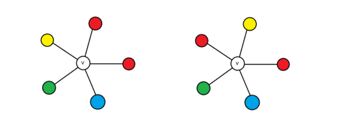
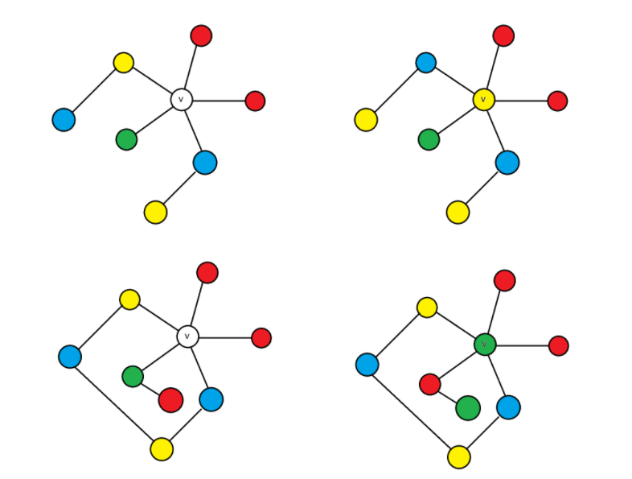
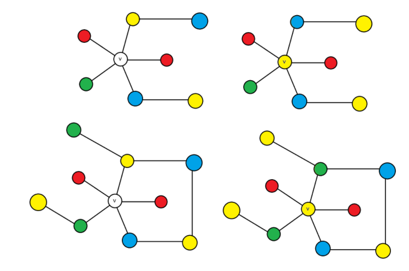
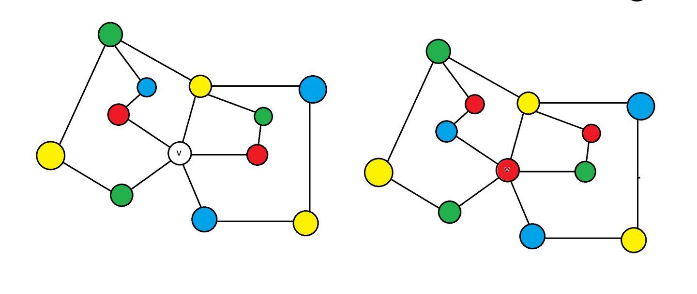
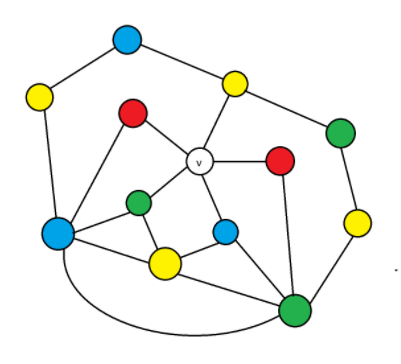
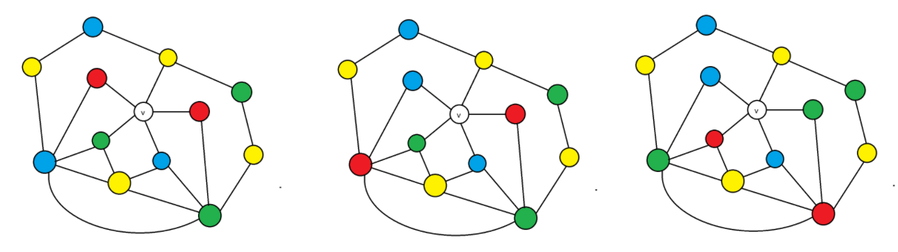

# 两大著名伪证

直到 1890 年 Heawood 指出错误之前，Kempe 的四色定理伪证被当时数学界最顶尖的头脑审阅通过，并且认为这是逻辑严谨的。这个如此异常的情况就决定了我们如果想要真正理解四色定理为什么对，就必须讲解这个著名的错误，通过这个著名的错误，也多多少少可以理解一下，当计算机证明刚刚出来时，为什么数学界会有很大的质疑的声音，他们并非守旧，而是太担心这个极其复杂的证明拥有一些难以审查的错误了。

我们下一段，在指出错误之前，会像讲解一个真正的证明一样讲述 Kempe 的伪证，你能够看出它的逻辑漏洞嘛？

## Kempe 的伪证

我们希望证明度数为 5 的情况同样是可约的。

考虑一个存在度数为 5 的顶点 $v$ 的平面图 $G$ ，如果 $G$ 去掉这个度数为 5 的顶点 $v$ 就能完成 4 染色，那么不妨把 $G$ 画在平面上，然后我们用 4 种颜色对除了 $v$ 以外的顶点染色。

现在考虑 $v$ 的相邻顶点，如果 $v$ 的邻居只出现了 3 种颜色，则可以把 $v$ 染色成为没出现的那种颜色。

因此 $v$ 的好邻居一共有 4 种颜色，考虑 5 个顶点如何分配这四种颜色，容易发现，一定是有恰好一种颜色出现恰好两次，其它颜色出现各一次。

不妨设红色恰好出现两次，由对称和颜色交换，可以容易归纳成这两种情况[3]：

- $v$ 的 5 个邻居，其邻居按照顺时针排列，颜色分别是：红、红、黄、绿、蓝。
- $v$ 的 5 个邻居，其邻居按照顺时针排列，颜色分别是：红、黄、红、绿、蓝。

其它的都可以归纳到这两种情况。

如图所示，展示了各种颜色的顶点排列情况，左图是第一种情况红红黄绿蓝，右图是第二种情况红黄红绿蓝

第一种情况非常平凡，与度数为 4 的顶点的证明相差无几，即考虑黄蓝二色导出子图，如果黄邻居和蓝邻居在其中不连通，对黄邻居所在连通块黄蓝反色再把 $v$ 染黄；否则考虑红绿二色导出子图，由于黄蓝双色路的存在，绿邻居必然与任一红邻居在其中不连通，对绿邻居所在连通块红绿反色再把 $v$ 染绿，就是合法的情况了。

如图用四张图染色局面展示了这两种情况，上面的两张图是黄蓝邻居不连通的状况展示和染色策略；下面的两张图是黄蓝邻居连通的状况展示和染色策略

接下来考虑第二种情况，即红黄红绿蓝如何处理，不妨设逆时针第一个（夹在黄蓝邻居中间）的顶点为红一，另一个为红二，这里我们还可以再判掉两种平凡的子情况：

- 考虑黄蓝二色导出子图，如果黄邻居和蓝邻居在其中不连通，对黄邻居所在连通块黄蓝反色再把 $v$ 染黄。
- 否则，考虑黄绿二色导出子图，如果黄邻居和绿邻居在其中不连通，对黄邻居所在连通块黄绿反色再把 $v$ 染黄。

如图用四张图染色局面展示了这两种情况，上面的两张图是黄蓝邻居不连通的状况展示和染色策略；下面的两张图是黄绿邻居不连通的状况展示和染色策略

只剩一种情况要考虑，那就是同时存在黄绿双色链和黄蓝双色链的图，那么，这两条双色链会把两个红色顶点彻底隔开，更具体而言：

- 黄绿双色链和黄蓝双色链将平面划分为若干个区域，其中两个区域是 $P_1,P_2$ ，其中 $P_1$ 内部有红一， $P_2$ 内部有红二。
- 黄蓝双色链保证了红一所在的红绿二色连通区域被局限在 $P_1$ 内。
- 黄绿双色链保证了红二所在的红蓝二色连通区域被局限在 $P_2$ 内。
- 因此，对红一所在的红绿二色连通区域进行红绿反色，再对红二所在的红绿二色连通区域进行红蓝反色，此时即可将顶点 $v$ 染成红色。

如图展示了染色情况，既然红蓝二色连通区域和红绿二色连通区域不相交，那么我们可以对其分别反色，然后使得顶点 v 被染成红色

因此，我们就证明了额外度数为 5 的孤立点是可约的。

假设存在一个最小反例，显然它点数不小于 3（实际上不应该小于 5），由于它是平面图，它总存在度数为 1、2、3、4、5 的顶点，而去掉这个顶点，得到的图应该能够被四染色，可是这又能反过来推出这个最小反例能够被四染色，矛盾。

因此，最小反例不存在，四色定理成立（才怪！记住这是一个伪证）。

## Kempe 的错误之处与警示

在讲解之前，我想先让大家注意一下这一件事实，我证明一个看似显然的结论：顶点个数大于 3 的极大平面图的每个面的边缘都是三角形的证明量；之所以说它看似显然，是因为人们很容易这样想：多边形内部加边到不能再加就是三角形了，所以得证。

我在 [Kuratowski 定理的基础证明](https://zhuanlan.zhihu.com/p/1994893756747515716) 这篇文章在“2-连通图的性质这一节”用约 3500 字（大致相当于你看到这里字数的一半）和 3 张图证明了 2-连通平面图的每个面一定是个圈（多边形），再用 400 字证明极大平面图在点数不小于 3 的前提下是 2 连通的；也就是说，我在证明这个直观命题中花费了大约 3900 字。

这么做的原因是一个拓扑构型的问题，即面的边缘不一定是圈，也就是说，如果你面对一个拓扑上看似显然的东西不仔细拆开来检查，你是会遗漏的，在极大平面图的证明中，你最多遗漏掉图的点数小于 3 的平凡情况，但在另一些地方，你会遗漏更多。

我之所以强调这个事实，是因为我可以下一个简单的断言，即任何一个系统学习过拓扑图论的人应当也必须怀疑我之前表述中一个过于跳步的拓扑论断，即隐含地假定 $P_1,P_2$ 无交，实际上，由于两个双色链可以共用黄色顶点， $P_1\cap P_2$ 可能非空。

而这正是 Heawood 在其 1890 年的论文[4]中指出的问题。

如图给出了一种 P1 与 P2 相交的情况，很显然，此时红一的红绿二色区域和红二的红蓝二色区域产生了连边

此外还有一个警示，即图解在图论中的作用：它应该仅仅用于理解，真正核心部分的准确性不应当依赖于任何图解。

总之既然 $P_1\cap P_2$ 非空，红一所在的红绿连通块和红二所在的红蓝连通块就可能会在反转时干扰到相当多的东西，具体而言，比如先对红二进行反色，产生的影响可能使得红一所在的红绿连通块与 $v$ 的绿色邻居连通，此时再对红一所在的红绿连通区域进行红绿反色，虽然红一所在的顶点变成绿色了，可 $v$ 原本的绿色邻居也变成红色了，还是无法染上四种颜色之一。

如图是 Kempe 的方法失败的演示，左图是未进行反色，中图是对红二所在的红蓝连通块反色，右图是对红一所在的新红绿连通块反色，显然，右图中的反色导致 v 的原绿色邻居变色，因此失败了

（上图这个例子是我由 Heawood 的反例[5]做了一定的简化得到的，主要是为了说明 Kempe 逻辑为什么有问题，因此提炼了主干，与原论文有出入）

这个错误发生是有理由的，因为 Kempe 的伪证发生在图论的极早期；那个时候拓扑图论这个现在极其重要的分支学科正处于胚胎期（作为对比，Jordan 曲线定理在 1887 年才被提出且初版证明有争议，Kuratowski 定理在 1930 年才被提出并证明，在这之后勉强算婴儿期），那个时候的数学研究者还没有“处理拓扑必须小心谨慎”的意识，发生这样的错误情有可原。

当然，你可能会想，我是不是可以在上面打补丁然后完成四色定理的证明呢，实际上，这是绝大部分研究者一开始的想法，但，被 Kempe 骗了一次的研究者们，再也没有轻易地再次受骗。目前一般认为，额外度数为 5 的孤立点的可约性无法被轻易证明。

这也提醒我们，数学是严谨的学科，任何依赖图形直观的推导过程，其基础都是摇晃的。

## Tait 的转化

相比于 Kempe 的自信，Tait 在其 1880 年的论文[6]中，传达的态度更像是“我认为我的表述抓住了证明的核心思路，但我不认为我的表述就是一个完整的证明”，实际上，他的怀疑是正确的。

（实际上，科普圈的一个常见的误解是 Tait 武断地认为 Tait 猜想成立，完全不是这样，Tait 之所以以为自己做出了证明，和 Tait 猜想无关，而是基于另外一套复杂的归纳与图形分解方法）

Tait 的核心转化是将四色定理由面染色问题转化成了平面图边染色问题。

用很简单的语言可以讲清楚 Tait 做了什么，简单而言，我们已经知道如果四色定理成立，那么任何一个极大平面图的点色数不超过 4。

Tait 发现，任取一个极大平面图，考虑以下两个性质：

- 这个极大平面图的每个点都被染成了 00、01、10、11 四种颜色之一，使得该极大平面图相邻顶点颜色不同，这被称作该极大平面图的点色数不超过 4。
- 这个极大平面图的每条边都被染成了 01、10、11 三种颜色之一，使得该极大平面图任一面上的三条边颜色不同，这被称作该极大平面图的对偶图边色数恰好为 3。

Tait 证明了前者是后者的充要条件，证明方法，居然是异或，注意到 01、10、11 的异或为 0。

必要性证明，若一极大平面图 $G$ 的每个点都被染成了 00、01、10、11 四种颜色之一，使得该极大平面图相邻顶点颜色不同，则令其任一边染色为其连接的两顶点之异或，显然，由于相邻顶点颜色不同，边染色只能在 01、10、11 三种之中取值；且，任取共面的边 $(u,v),(u,w)$，它们颜色的异或等于 $v$ 和 $w$ 的异或，由极大平面图的性质，$v,w$ 相连，因此就得到了 $G$ 的对偶图的 3-边染色方案。

充分性证明，若一极大平面图 $G$ 的每条边都被染成了 01、10、11 三种颜色之一，则该极大平面图的任何一条闭路径的异或都为 0，这是因为，任取一个闭路径，考虑其内部的每个三角形面上的边，都拿出来异或，最终结果一定是 0，但考虑这个过程中不在闭路径上，但在闭路径内部的边权重被异或了两次，抵消了，而只有在环路上的边有效地参与了异或；因此，任何一个闭路径的异或都为 0。

由于极大平面图的性质，它是连通图，可以任取一个点 $u$ 为基准点，染成颜色 00，然后，任意一个点 $v$ 的颜色被定义为 $u$ 到 $v$ 任一路径的权重的异或，由于任何一个闭路径的异或都为 0，它是良定义的（考虑任何两条 $u$ 到 $v$ 的路径，它们合在一起就是一条闭路径），显然只能染色成 00、01、10、11 四种颜色之一，且此时取任一一条边，容易证明它连接的两个顶点颜色不同。

因此，Tait 说明了，如果四色定理成立，那么任何一个极大平面图的对偶图的边色数不超过 3。

这看起来并没有简化？好吧，至少 Tait 认为是简化了，而且做了其它复杂但被我们省略的操作。但是，我们也不能觉得这是无用的，也许，3 种颜色真的比 4 种颜色要看起来简单呢。

