# 连通性归约

即使 Kempe 的证明失败了，数学家们在打补丁的过程中，发现了一系列更复杂的构型，具体而言由于平面图的连接越密集，色数往往越高，所以这个过程往往是把全体平面图往更加连通的地方驱赶。

显然，能连的边多连一点，图的连通性会更好。

这个我们已经考虑了，所以我们现在主要考虑的是极大平面图。

很平凡的，一个图的最小度数比较小，这个图连通性看起来就不太好，因为只要去掉这个点的为数不多的邻居就可以了。

这个我们已经考虑了，所以我们现在主要考虑的是最小度数为 5 的极大平面图。

> **定义（分离圈）**
>
> 如果一个平面图中存在一个很小的圈，它的内部和外部都有顶点，那么这个构型称作**分离圈**，其中长度为 $k$ 的称作 **$k$ - 分离圈**。

（分离圈其实并不能用我们之前定义的构型来定义，但并不影响我们把可约性的概念沿用到分离圈中，即我们能通过某种手段证明，如果一个平面图包含了这个结构，且有一个点数更少的平面图能被 4 染色，那么这个图就能被 4 染色）

> **命题（2-分离圈与 3-分离圈可约）**
>
> 2-分离圈和 3-分离圈都是可约的。

**证明：**

容易导出 2-分离圈是可约的，注意到极大平面图本身一定不包含 2-分离圈（这意味着重边），而 3-分离圈的可约性则较为明显，具体而言，如果一个平面图存在 3-分离圈，那么就可以先对（带着 3-分离圈）的外部和（带着 3-分离圈）的内部进行染色，如果这两个更小的平面图能够 4-染色。

显然，由于图染色的性质，3-分离圈上必然染了三种颜色，因此可以通过颜色替换，钦定两个染色方案分别交换颜色使得 3-分离圈内部的颜色依次是红黄绿（另一个不出现在 3-分离圈内部的颜色被染蓝），然后将 3-分离圈对位拼合，就得到了原平面图的四染色方案。$\blacksquare$

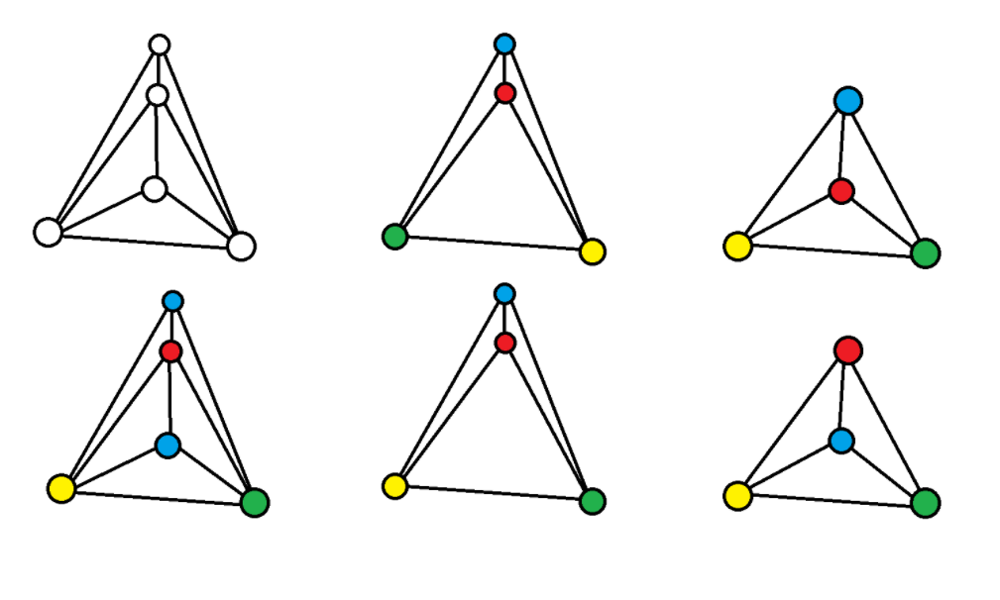
如图是一个带 3-分离圈的平面图例子，右图是包含 3-分离圈的内部和外部图分别进行染色，下方进行了颜色交换使得 3-分离圈可以对位拼合

> **定理（Birkhoff，分离圈的可约性）**
>
> 4-分离圈和内部和外部分别至少有两个顶点与圈连通的 5-分离圈是可约的。

注意“内部和外部分别至少有两个顶点与圈连通”的限制，不然可能会造成不必要的误解，比如以为 Birkhoff 证明了 5 度顶点可约并终结了四色定理，并没有。

## 收缩和合并

> **定义（收缩操作）**
>
> 对于一个图 $G$ 和其上的任意一条边 $e$ ，定义 $G\cdot e$ 为一个新图，如果 $e$ 连接了两个顶点 $\{x,y\}$ ，那么在新图中，这两个顶点将会被合并，而且，这两个顶点的内部连边将会被去掉，从其他顶点连向这两个顶点的边将会连向这个新的顶点。这个操作称为**收缩**。

> **命题（收缩保持平面性）**
>
> 一个平面图在经过一次收缩操作之后，仍然是平面图。

**证明：**

考虑一个平面嵌入，其上相邻的顶点，总是可以画一条闭曲线包住这两个顶点，而不包住任何多余的顶点或不与这两个顶点相邻的边，将这个闭曲线当作新的顶点，将包住的边当作新的顶点的连边情况，即可得到新图的平面嵌入。$\blacksquare$

在[Kuratowski 定理的基础证明](https://zhuanlan.zhihu.com/p/1994893756747515716)中，我们同样介绍了收缩操作，以此为基础：

> **定义（合并）**
>
> 如果一个平面图上的两个点共面，如果它们有直连边，直接将这条边收缩，否则，将这两个顶点连边再将这条边收缩，我们把这个操作叫做**合并**。

由于平面图一次收缩操作之后仍然是平面图，平面图经过一次合并操作后同样也是平面图。

也就是说，合法的合并操作不会破坏图的平面性。

## 4-分离圈可约

**证明：**

考虑证明 4-分离圈可约，还是传统操作，分成内外两部分（都带上 4-分离圈）。

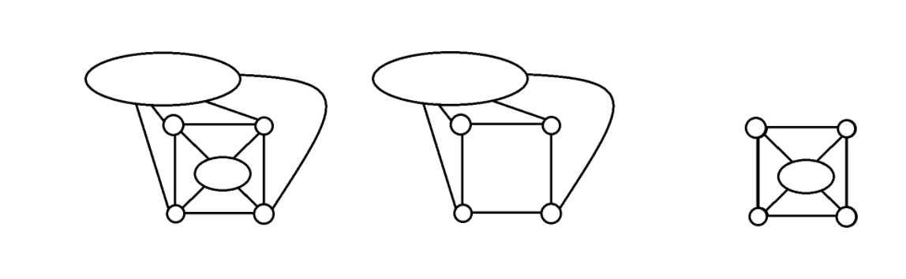
如图，图的构型都要带上内外两部分，而且必须都带上 4-分离圈

不过嘛，由于图的环比较多了，我们得想办法让环上的染色方案都差不多。

钦定外部那部分图称为外部图，内部那部分图称为内部图。

这里有一个比较容易忽略的细节，即圈内部顶点可能有直接连边，即弦，此时，我们钦定如果弦被嵌入在外部，那么外部图包含该弦而内部图不包含该弦；反之，如果弦嵌入在内部，那么内部图包含该弦而外部图不包含该弦，后续证明 5-分离圈的时候，我不会重复讲解这一逻辑，因为原理是相同的。

为了不依赖图解，我们钦定任取分离圈上的一个顶点，顺次标记，在外部那部分图逆时针标记为 $u_1,u_2,u_3,u_4$ ，在内部那部分逆时针标记为 $v_1,v_2,v_3,v_4$ ，与环上原本的结构对应，在作图时标记为左上、左下、右下，右上；或者称为 $1,2,3,4$ 号位置。

以外部那部分为例，我们把 $u_1,u_3$ （左上、右下）合并为一个顶点（可以顺便去掉重边，但不影响），由归约逻辑，由于新图是顶点数更少的平面图，不妨假设它可以 4-染色。染完色之后，再把合并的顶点拆分开来，这样子，仍然是外部部分的一个合法的染色，而且保证了 4-分离圈 $u_1,u_3$ 被染成一个颜色。

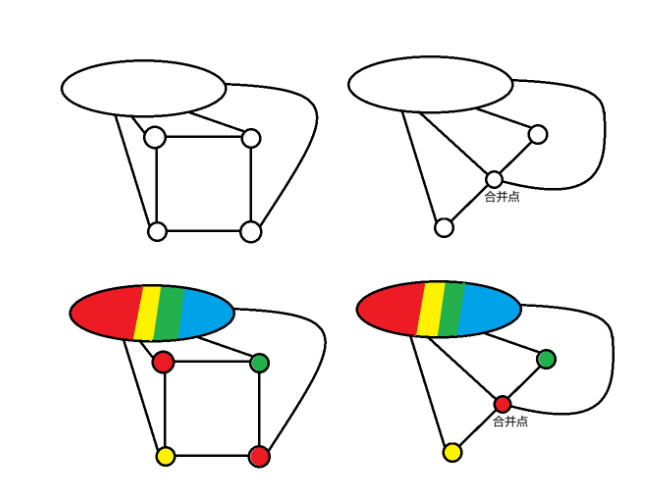
如图的 4 张图按照顺时针顺序展示了带 4-分离圈的外部图经过合并得到更小的图，对这个更小的图进行四种颜色染色，然后还原回原本带 4-分离圈的外部图的一个 4-染色，这样可以保证 4-分离圈左上角和右下角的顶点被染成一个颜色

通过完全相同的方法（对内部操作/左下角和右上角合并），我们可以得到四类（可能有重复的）染色方案：

- 带 4-分离圈外部的染色方案，保证 $u_1,u_3$ 颜色相同。
- 带 4-分离圈外部的染色方案，保证 $u_2,u_4$ 颜色相同。
- 带 4-分离圈内部的染色方案，保证 $v_1,v_3$ 颜色相同。
- 带 4-分离圈内部的染色方案，保证 $v_2,v_4$ 颜色相同。

在考虑了简单的颜色交换之后，仅剩下三种可能的 4-分离圈染色方案：

- 两对相等：红黄红黄。
- $1,3$ 号位置相等：红黄红绿。
- $2,4$ 号位置相等：红黄绿黄。

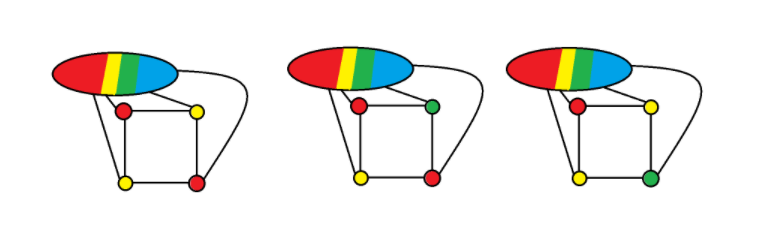
如图所示，展示了两对相等、左上角和右下角相等和左上角和右下角相等的三种情况

注意我们得到了 4 类可能有重复的染色方案，此时，如果还不存在一对能够进行对位拼合的方案，只有一种可能，即一方的两种方案都是两对相等（红黄红黄），另一方的两种方案分别是红黄红绿和红黄绿黄。

此时考虑带红黄红黄的那方，考虑黄绿二色导出子图中，分离圈上两个黄点不在同一连通区域，对右上角黄点（4 号位置）所在黄绿二色连通区域进行黄绿反色即归约到另一方的一种情况（红黄红绿）。

否则，黄绿双色链的存在保证了，考虑红蓝二色导出子图，分离圈上的两个红点不在同一连通区域，此时，对右下角红点（3 号位置）所在红蓝二色连通区域进行红蓝反色，再对整个图交换蓝绿二色，即可归约到另一方的另一种情况（红黄绿黄）。

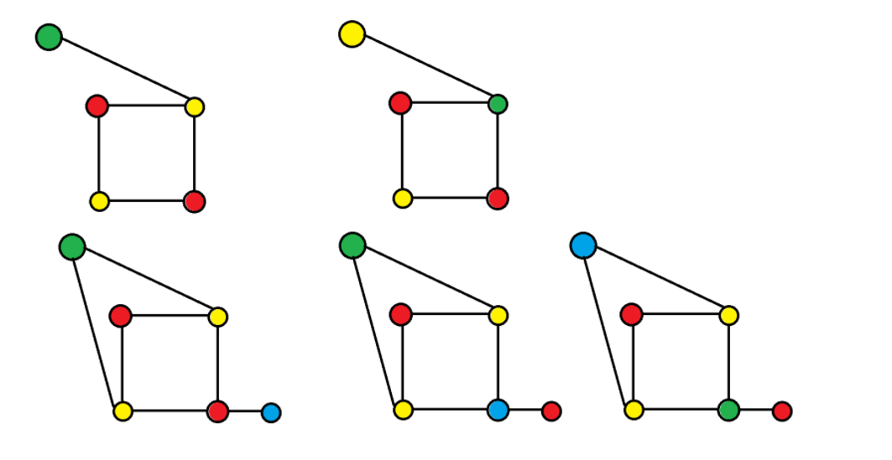
如图展示了两种情况都能把一方的两对相等化为另一方的某个染色方案，其中上方展示了不存在黄绿双色链的情况；而下方展示了存在黄绿双色链的情况

因此，不论如何带 4-分离圈的图不会是最小反例，即 4-分离圈可约。$\blacksquare$

## 5-分离圈何时易证可约

> **定理（5-分离圈的可约性）**
>
> 当 5-分离圈内部和外部连通的顶点个数大于 1 时，该类构型可约。

**证明：**

同样，依照老操作分成内外两部分。

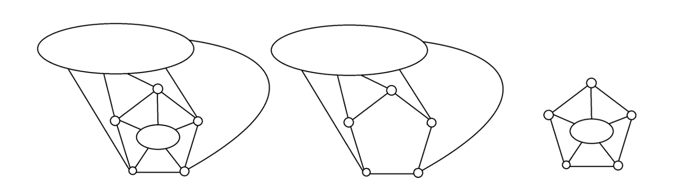
如图所示，三个分别是原图示意，外部示意和内部示意，外部和内部当然都带着分离圈

此时，比如说如果是外部图的染色，那么我们在圈内仅放一个点，然后连接到其它五个顶点上，此时，由于 5-分离圈内部连通的顶点个数大于 1，所以这是一个顶点数更小的图，由我们基于最小反例法的归约逻辑，我们可以假定其能够 4-染色并给出一种染色方案，对应到原本的外部图，即给出了一种染色方案，使得 5-分离圈上只有三种颜色（不可能少于 3 种，因为奇圈的色数抛出就是 3）。

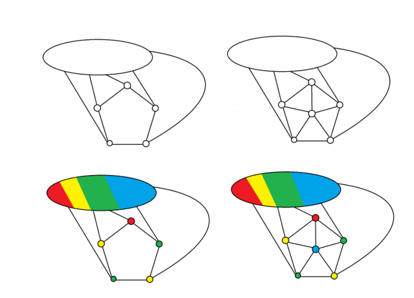
如图的 4 张图按照顺时针顺序展示了带 5-分离圈的外部图加了一个点，对这个加点的图进行四种颜色染色，然后还原回原本带 5-分离圈的外部图的一个 4-染色，这样可以保证 5-分离圈上有且仅有三种颜色

5-分离圈上的顶点既然只能出现 3 种颜色，不难注意到，通过颜色交换，实际上 5-分离圈上面的点按照顺时针排布一定是红黄绿黄绿的情况。

通过同样的方法，可以对内部图进行操作，接下来考虑拼接的问题，考虑红色（环上唯一仅出现一次的颜色）的位置，有三种情况：恰好对上，相邻，隔一个顶点。恰好对上的情况直接拼合即可，相邻和隔一个顶点的，需要单独讨论。

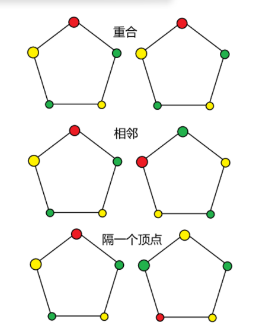
如图的六张图代表三种情况，上方是恰好对上，中间是相邻，下方是隔一个顶点；左右视图拼合，最上方显然可以直接对位拼合，下方的要小心了；不妨把左边设作方案一，右边设作方案二

对于内部和外部都有分离圈要对齐的情况，不妨把其中一个设作方案一，另一个设作方案二。

那么这三种情况分别对应，对环上顶点顺次标记 $1,2,3,4,5$ 且方案一中顶点$u_1,u_2,u_3,u_4,u_5$ 顶点颜色依次为红黄绿黄绿。

那么方案二中顶点 $v_1,v_2,v_3,v_4,v_5$ 顶点（其中 $u_i,v_i$ 在原圈中对应同一个顶点）颜色依次为：

- 红黄绿黄绿
- 绿红黄绿黄
- 黄绿红黄绿

首先处理隔一个顶点的情况，现设：

- 方案一中 $u_1,u_2,u_3,u_4,u_5$ 顶点颜色为红黄绿黄绿。
- 方案二中 $v_1,v_2,v_3,v_4,v_5$ 顶点颜色为黄绿红黄绿。

考虑包含 $v_2,v_3$ 的红绿连通区域，若该连通区域不连通到 $v_5$ ，将该连通区域红绿反色，得到黄红绿黄绿，对整个图黄绿反色即可转化为相邻情况。

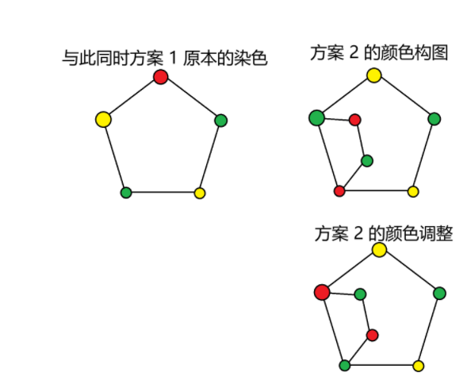
如图，左列是方案 1 的 5-分离圈构图，右列演示了方案 2 中如果包含 v2 v3 的红绿连通区域不连通，如何调整得到相邻的情况

否则，我们就有方案 2 中 $v_2,v_3$ 的红绿连通区域连通到 $v_5$ 的重要条件，考虑方案一中合并 $u_2,u_5$ 得到的新图由于比我们要证明的图小，由最小反例法的约束，也可以给出 4 染色。

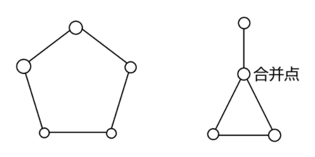
如图，左图是原本的 5-分离圈，右图是合并后的结果，新图仍然是平面图，且可以认为能够 4 染色

具体而言，如果考虑全图的颜色置换，一共有且仅有三种情况（名字只是标记，重点在于后面的颜色序列，它对应 $u_1,u_2,u_3,u_4,u_5$ 的染色方案）：

- $u_3$ 的颜色单独出现：绿黄红绿黄
- $u_4$ 的颜色单独出现：绿黄绿红黄
- 四色：绿黄红蓝黄

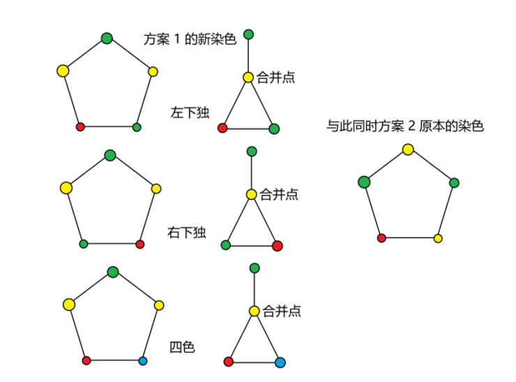
如图，左边三行展示了方案 1 的新染色的三种可能情况，即 u3 颜色单独出现、u4 颜色单独出现和四色；与此同时，方案 2 原本的染色作为对照

显然，方案一 $u_3$ 的颜色单独出现的情况经过全图黄绿反色可以与方案 2 匹配；方案一 $u_4$ 的颜色单独出现的情况可以理解为“相邻”情况，即把隔一个顶点的情况转化为了相邻的情况。

现在仅仅剩下方案一四色的情况了，此时，请注意，由于我们之前还用了一个双色链逻辑进行归约，所以现在方案 2 中 $v_2,v_3$ 的红绿连通区域连通到 $v_5$；而这可以保证，考虑包含 $v_4$ 的黄蓝连通区域，由于红绿连通区域的隔绝（整个结构要么完整在圈内，要么完整在圈外），不必担心它与 $v_1$ 连通，可以对该 $v_4$ 所在的黄蓝连通区域进行黄蓝反色；再对方案一全图进行黄绿反色，即可使得环上颜色排布相同。

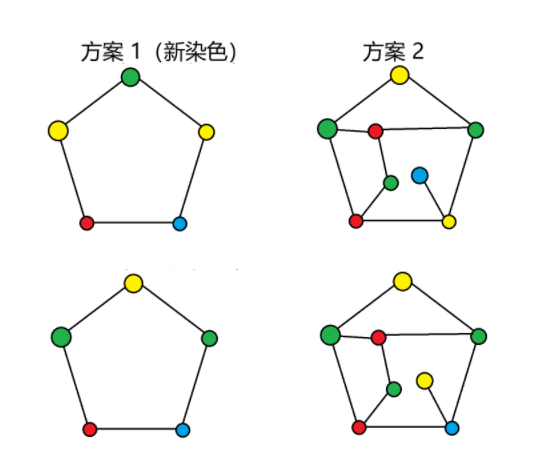
如图，左边是对方案 1 新染色方案的调整，右边是对方案 2 的原有方案的调整，由于我们确定了 v2 v3 v5 的红绿双色区域连通，所以可以对 v4 所在黄蓝连通区域进行黄蓝反色

总之，我们已经把“隔一个顶点”的方案全部归约到了“相邻”的方案，现在我们考虑相邻的方案，即设：

- 方案一中 $u_1,u_2,u_3,u_4,u_5$ 顶点颜色为红黄绿黄绿。
- 方案二中 $v_1,v_2,v_3,v_4,v_5$ 顶点颜色为绿红黄绿黄。

此时我们稍微形式化一下，我们设 $f_1(i)$ 表示方案一中 5-分离圈中仅出现三种颜色，且 $u_i$ 被染成的颜色仅仅出现一次的染色方案； $f_2(i)$ 表示方案二中 5-分离圈中仅出现三种颜色，且 $v_i$ 被染成的颜色仅仅出现一次的染色方案。

目前我们的情况是 $f_1(1)$ 和 $f_2(2)$ 是合法的染色方案。

在方案二中，考虑包含 $v_1,v_2$ 的红绿双色连通区域，如果它不与 $v_4$ 连通，对该连通区域进行红绿反色，再对方案一中全图进行黄绿反色，顶点即可贴合。

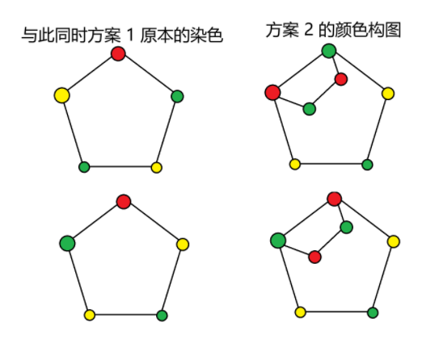
如图，左图是方案一的全图黄绿反色调整，右图是方案 2 的局部红绿反色调整

否则，包含 $v_1,v_2$ 的红绿双色连通区域与 $v_4$ 连通。

此时对方案一构造合并 $u_1,u_4$ 的辅助图，由最小反例法，可以假设该新图能够四染色，那么一共可以分为如下情况（名字只是标记，重点在于后面的颜色序列，它对应 $u_1,u_2,u_3,u_4,u_5$ 的染色方案）：

- $f_1(2)$ （ $u_2$ 的颜色单独出现）：黄红绿黄绿
- $f_1(3)$ （ $u_3$ 的颜色单独出现）：黄绿红黄绿
- 四色：黄红蓝黄绿

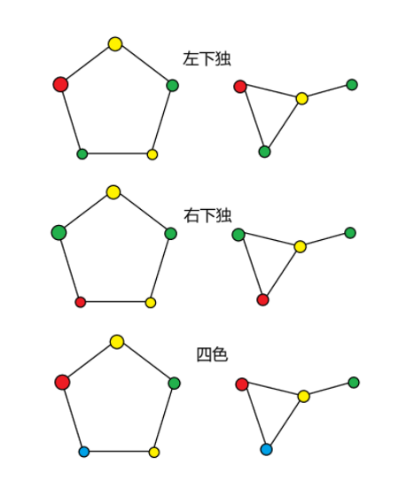
如图，三行图分别是 f1(2)，f1(3) 和四色，注意黄点是合并点

$u_2$ 的颜色单独出现的情况，即 $f_1(2)$ ，它显然可以和 $f_2(2)$ 拼合。

对于四色的情况，由于我们之前已经明确了包含 $v_1,v_2$ 的红绿双色连通区域与 $v_4$ 连通；（由于整个结构要么完整在圈内，要么完整在圈外）所以 $v_3$ 所在的黄蓝双色连通区域不与 $v_5$ 连通，对 $v_3$ 所在的黄蓝双色连通区域进行黄蓝反色，再对方案一的全图进行黄绿反色，圈即可对位拼合。

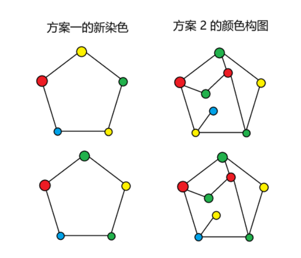
如图，对于四色的情况，由于我们之前已经明确了包含 v1,v2 的红绿双色连通区域与 v4 连通；（由于整个结构要么完整在圈内，要么完整在圈外）所以 v3  所在的黄蓝双色连通区域不与 v5  连通，对该 v3 黄蓝双色连通区域进行黄蓝反色，再对方案一的全图进行黄绿反色，圈即可对位拼合

也就是说，如果 $f_1(1)$  和 $f_2(2)$  同时存在，排除显然能被直接归约的情况，必然存在  $f_1(3)$ 。

同理，由于 $f_2(2)$ 和 $f_1(3)$ 同时存在，排除显然能被直接归约的情况，必然存在 $f_2(4)$ 。

同理，由于 $f_1(3)$ 和 $f_2(4)$ 同时存在，排除显然能被直接归约的情况，必然存在 $f_1(5)$ 。

同理，由于 $f_2(4)$ 和 $f_1(5)$ 同时存在，排除显然能被直接归约的情况，必然存在 $f_2(1)$ 。

由于 $f_1(1)$ 与 $f_2(1)$ 能被直接拼合，所以对于所有可能的情况，当 5-分离圈内部和外部连通的顶点个数大于 1 时，该类构型都是可约的。$\blacksquare$

请注意这样一个观察，即虽然仅仅包含一个顶点的 5-分离圈看上去更简单，但，实际上，包含更多顶点的 5-分离圈，给我们提供了更多变形的自由，这一思想非常重要。

## 内部 6 连通

尽管连通度的概念是在 Menger 在 1927 年发表 Menger 定理时确立其地位；Whitney 在其 1932 年的论文中正式提出的；所以 Birkhoff 在当时不太可能用连通度的语言来描述他的发现，但我们现在知道，他的归约说明了什么。

> **定义（内部 6 连通）**
>
> 一个图**内部 6 连通**，当且仅当它的点连通度不小于 5，而且如果它存在大小为 5 的点割集，那么该点割集一定只能将该图划分为至多两个部分，而且必须是一个孤立点和另一个连通区域。

> **定理（Birkhoff 归约）**
>
> 如果四色定理存在最小反例，那么它一定是一个内部 6 连通的极大平面图。

**证明：**

自然，这个结论是需要证明的，我们不会放过这些细微之处，我们首先证明一个引理：

> **引理（极小点割集的导出子图成圈）**
>
> 对于顶点数大于 3 的极大平面图，任意一个极小点割集，其导出子图总是一个圈。

> **定义（极小点割集）**
>
> 所谓**极小点割集**，就是这样一个点集，它把一个图分成至少两个独立的连通区域，且加上其中的任何一个点，得到图都会连通。

考虑一个极大平面图 $G$ ，任取一个极小点割集 $S$ ，不妨考虑 $G-S$ （去掉 $S$ ）分为了 $G_1,G_2,\cdots,G_k$ 等若干个连通分量。

我们首先证明 $k=2$ ，即只能分割成两个连通区域。

这是因为，假设 $k\ge 3$ ，由于 $G$ 是 3-连通图，因此 $S$ 至少包含 3 个顶点，不妨记作 $s_1,s_2,s_3$ 。

这三个顶点必须和 $G_1,G_2,G_3$ 的每一个连通分量都相连，否则，不妨设 $v_1$ 不与 $G_1$ 相连，那么，即使割集去掉 $v_1$ ， $G_1$ 仍然不会和其它部分连通，违背了最小点割集的定义。

此时，考虑包含 $s_1,s_2,s_3,G_1,G_2,G_3$ 全部顶点的导出子图，它是一个平面图，但是，我们对 $G_1,G_2,G_3$ 内部的每条边以任意指定次序收缩，得到的结果也应当是一个平面图，但，由于这三个顶点必须和 $G_1,G_2,G_3$ 的每一个连通分量都相连，我们一定会得到 $K_{3,3}$ ，而我们知道这不是平面图，矛盾，所以 $k=2$ 。

由于 $k=2$ ，考虑一个极大平面图 $G$ ，任取一个极小点割集 $S$ ，不妨考虑 $G-S$ （去掉 $S$ ）分为了 $A,B$ 两个连通分量。

我们知道，一个顶点数大于 3 的极大平面图，任取一个顶点，其相邻顶点的导出子图可以仅仅通过删边得到一个圈。

考虑任取顶点 $s\in S$ ，考虑按照其相邻的全体顶点的导出子图中的一个圈，按照该圈的顺序排列顶点 $s_1,s_2,\cdots,s_n$ ，显然，它们中的每一个，属于且仅属于 $A,S,B$ 中的一个集合。

由于 $S$ 是极小点割集，所以 $s_1,s_2,\cdots,s_n$ 中必然存在属于 $A$ 的顶点，也必然存在属于 $B$ 的顶点，而由于点割集的性质，轮换时，从 $A$ 到 $B$ 进行切换，必然经过属于 $S$ 的顶点，即 $A-S-B,B-S-A$ 构型。

先强调一下，任何属于 $S$ 的顶点，邻居必定有属于 $A$ 的和属于 $B$ 的顶点。

此处，由于 $A$ 到 $B$ ， $B$ 到 $A$ 至少要完成两次切换，因此属于 $S$ 的邻居至少有两个顶点。

但是，考虑 $S$ 发挥的作用，我们必须排除以下两种构型，即证明：

- 不存在“不参与切换”的 $S$ 邻居（ $A-S-A,B-S-B$ 构型）。
- 不存在“多个 $S$ 邻居共同完成一次切换”的情况（ $A-S-S-B$ 构型）。

先证明不存在“不参与切换”的 $S$ 邻居，不妨设参与构型顶点为 $a_1,s_1,\cdots,s_m,a_2$ ，其中 $m\ge 1$ ，由于 $A$ 连通，存在一条只包含 $A$ 顶点的路径 $P_A$ 连通 $a_1,a_2$ ，与顶点 $s$ 构成了一个闭合圈，其中 $s_1,s_2,\cdots,s_m$ 都是圈内的顶点，由于定义， $s$ 必然有一个属于 $B$ 的邻居 $b$ ，此时 $P_A$ 不会经过 $b$ ，因此从拓扑上可以确认 $b$ 在闭合圈外。而圈内的所有属于 $S$ 的顶点必然有闭合圈内属于 $B$ 的邻居，而这与 $B$ 是连通的这一条件矛盾，因此，不存在“不参与切换”的 $S$ 邻居。

再证明不存在“多个 $S$ 邻居共同完成一次切换”的情况，不妨设顶点依次为 $a,s_1,s_2,\cdots,s_m,b$ ，其中 $m\ge 2$ ， $s_m$ 必定存在属于 $A$ 的邻居，不妨设为 $a_2$ （可能与 $a$ 重合），由连通性，存在 $a$ 到 $a_2$ 的路径 $P_A$ ，而 $P_A,s_m,s$ 仍然构成一个圈，其中 $s_1,s_2,\cdots,s_{m-1}$ 都是圈内的顶点，后续同理， $b$ 在圈外，又可以证明圈内有属于 $B$ 的顶点，矛盾，故不存在“多个 $S$ 邻居共同完成一次切换”的情况。

接下来我们考虑还有什么情况可以导致 $S$ 的导出子图中 $s$ 的度数大于 2，只剩下一种情况，即我们只需要证明不存在 $A_1,s_1,B_1,s_2,A_2,s_3,B_2$ 这样的结构，因为取 $A_1$ 的第一个顶点 $a_1$ 和 $A_2$ 的最后一个顶点 $a_m$ ，存在 $P_A$ 连通这两个顶点，而 $P_A$ 和 $s$ 又构成圈，使得 $B_1,B_2$ 在内外两侧，与连通性矛盾，所以不存在 $A_1,s_1,B_1,s_2,A_2,s_3,B_2$ 这样的结构。

所以，我们证明了， $s$ 的邻居中属于 $S$  的顶点有且仅有两个。

这说明 $S$ 的导出子图每个顶点的度数恰好为 2，即每个连通分量都是圈。

我们首先证明对于 $S$ 的导出子图中的任何一个圈 $C$ ， $A,B$ 不能同时在圈的内部或同在圈的外部。

反证法，不妨假设 $A,B$ 同时在圈的外部，那么圈内如果有任何顶点，必定属于 $S$ ，但圈内的顶点只能通过 $A,B$ 和 $C$ 连通，因此没有办法做到连通，而原图是连通图，因此，圈内必定是空的；而由于这个圈内是空的，由极大平面图的性质，圈必定是一个三角形圈，不妨设其内顶点为 $x,y,z$ 。

考虑 $x$ 的全体邻居，由于 $x,y,z$ 共面， $x$ 的邻居的导出子图删边得到的圈中 $y,z$ 必定相邻，这与前文证明的不存在“多个 $S$ 邻居共同完成一次切换”也不存在“不参与切换”的情况矛盾。

所以既然对于一个圈 $A,B$ 已经被分割为了内部和外部，就一定只需要保留这个圈 $C$ ，即如果 $S$ 是极小点割集，那么 $S=C$ 。

即证明了对于顶点数大于 3 的极大平面图，任意一个极小点割集，其导出子图总是一个圈。$\blacksquare$

又由于已经证明了最小反例不存在 3-分离圈，4-分离圈，内外顶点个数不小于 2 的 5-分离圈；且极大平面图的连通度至少是 3。

我们得到了最小反例一定是内部 6 连通的极大平面图的结论。$\blacksquare$

让我们轻松一点吧，看一下一个顶点数最少的“内部 6 连通的极大平面图”，它是正二十面体画在平面上的结果，由于 $6-\dfrac {12}n=\overline d\ge 5$ ，所以顶点数 $n\ge 12$ ，这的确是最小的了。

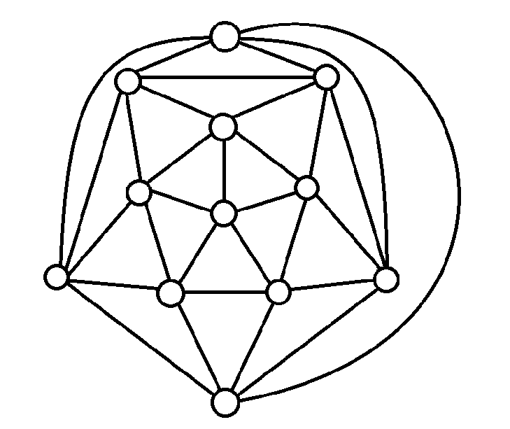
如图是正二十面体图的一个平面嵌入，它的顶点数恰好是 12

