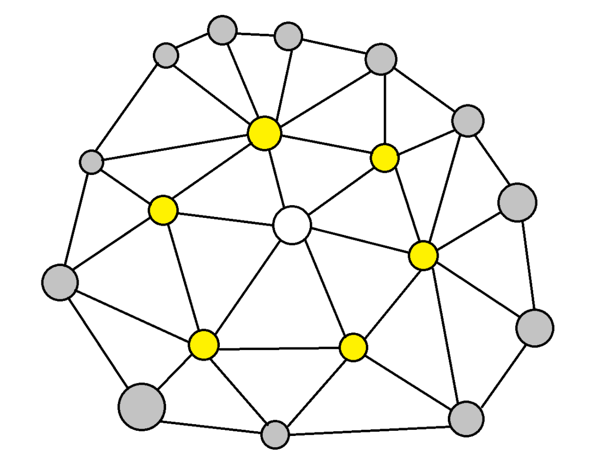
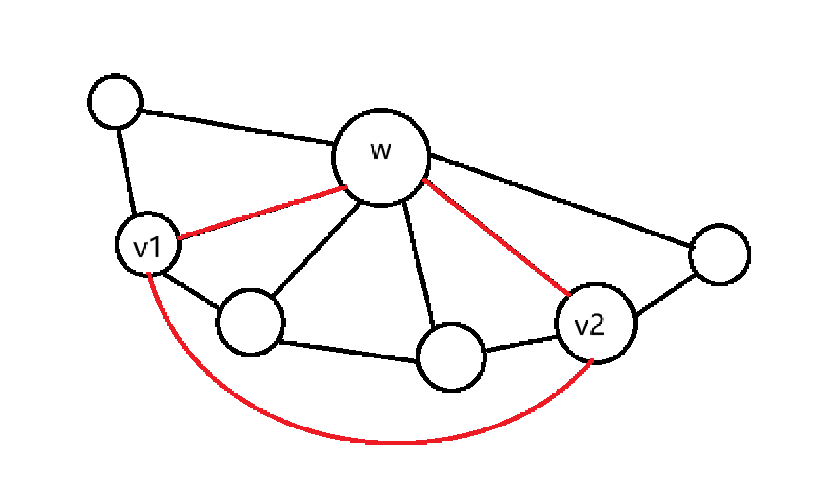
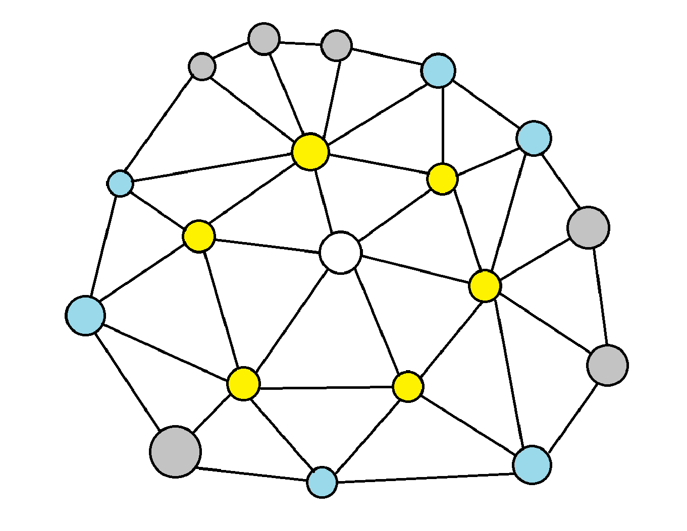
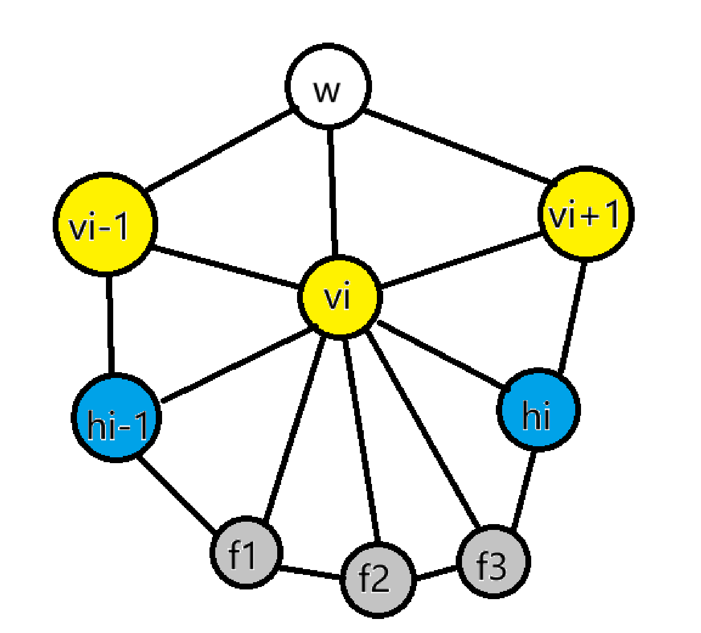
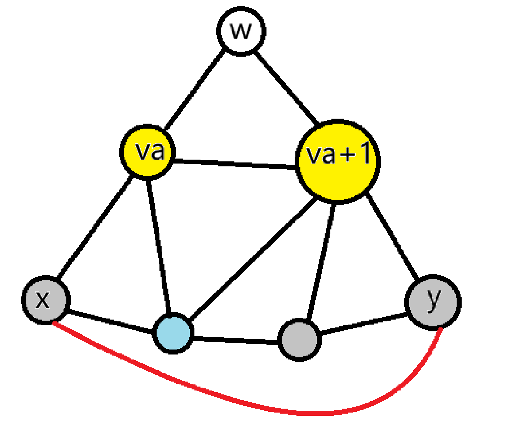

# 顶点邻域的双圈结构

现在我们已经知道了最小反例是内部 6 连通的极大平面图，考察这种图的局部结构，结果非常整齐，这种图的每个顶点附近都有由两个同心圆组成的结构。

首先，由前面的结论，内部 6 连通的极大平面图的最小度数至少是 5，且不存在 3-分离圈和 4-分离圈，也不存在内外顶点个数不小于 2 的 5-分离圈。

> **定义（车轮构型）**
> 
> 以 $w$ 为轮心的车轮构型由两个点集 $C_1,C_2$ 组成，其中 $C_1$ 为 $w$ 的全体邻居，$C_2$ 的顶点集恰为全体 $C_1$ 的邻居中不属于 $C_1\cup\{w\}$ 的顶点。
> 
> $C_1$ 上的顶点称为轮辐顶点，而 $C_2$ 上的顶点称为外圈顶点。

如图是一个典型的车轮构型，可以被理解成一个平面图的局部，白色顶点是轮心，其中黄色顶点是轮辐顶点，灰色顶点是外圈顶点

## 内圈无弦

>**定理（轮辐是圈）**
>4 连通的极大平面图中，任取一个顶点 $w$，则 $w$ 的全体邻居的导出子图是一个圈。

**证明：**

前文已经证明了，由极大平面图的性质， $w$ 邻居的导出子图可以通过删边形成一个圈，不妨设该圈为 $C_1$，那么只需排除邻居之间可能存在多余的弦，假设 $w$ 的两个邻居 $v_i,v_j$ 之间有连边，且它们在圈上不相邻，那么 $w,v_i,v_j$ 构成一个三角形圈，$C_1$ 的两段弧分别位于它的两侧，构成一个 3-分离圈。

如图是 3-分离圈的图示，其中红色边标识出分离圈

而出现 3-分离圈与整个图是 4 连通极大平面图的性质矛盾，因此邻居之间没有弦，$w$ 的邻居的导出子图就是圈 $C_1$ 本身。$\blacksquare$

## 帽顶点和扇顶点

>**定义（帽顶点）**
>
>在 5 连通的极大平面图上取点 $w$ 和它的邻居 $C_1$，设 $C_1$ 由顶点 $v_1,v_2,\cdots,v_k$ 按顺序排列，对每个 $i$，边 $v_iv_{i+1}$（默认 $i+1$ 下标按照 $k$ 取模，即 $(i\bmod k)+1$，后同）由极大平面图性质，分隔的两个面都是三角面，至少有一个含 $w$，另一个三角面中非 $v_i,v_{i+1}$ 的顶点记为 $h_i$，称为 $v_iv_{i+1}$ 的**帽顶点**。

>**定义（扇顶点）**
>在 5 连通的极大平面图上取点 $w$ 和它的邻居 $C_1$，设 $C_2$ 的顶点集恰为全体 $C_1$ 的邻居中不属于 $C_1\cup\{w\}$ 的顶点，则 $C_2$ 中的顶点，如果不是帽顶点，则称为**扇顶点**。

如图所示，白色顶点是轮心，其中蓝色顶点是帽顶点，灰色顶点是扇顶点

>**定理（帽顶点的性质）**
>
>在 5 连通的极大平面图上取点 $w$ 和它的邻居 $C_1$，设 $C_1$ 由顶点 $v_1,v_2,\cdots,v_k$ 按顺序排列，则：
> $v_iv_{i+1}$ 的帽顶点 $h_i$ 在 $\{w\}\cup C_1$ 中的所有顶点中仅连接 $v_iv_{i+1}$ 两个顶点，且 $h_i$ 属于 $C_2$ ，且帽顶点 $h_i$ 两两不同。

**证明：**

这里证明主要就是疯狂构造分离圈。

由于没有重边，$h_i\ne w$。

先证明 $h_i$ 不与 $w$ 相邻，假设 $h_i$ 与 $w$ 相邻，则 $h_i\in C_1$，则 $h_i,v_i,v_{i+1}$ 三个顶点两两相邻，如果这三个顶点构成的三角形圈不是 $C_1$，就和 $C_1$ 的导出子图是个圈这一结论矛盾，如果这三个顶点构成的三角形圈是 $C_1$，则 $C_1$ 是 3-分离圈，同样矛盾，因此，$h_i\notin C_1$，即 $h_i$ 不与 $w$ 相邻。

再证明 $h_i$ 不与除了 $v_i,v_{i+1}$ 之外的其它轮辐顶点相邻，若 $h_i$ 与某个 $v_l$ 相邻，其中 $l\ne i$ 且 $l\ne i+1$，如果 $l\ne i-1$，则 $v_l$ 和 $v_i$ 在 $C_1$ 上不相邻，考虑圈 $wv_{i}h_iv_l$，它将 $C_1$ 分成了两个不相邻的部分，因此是 4-分离圈，矛盾，而如果 $l=i-1$，则 $v_l$ 和 $v_{i+1}$ 在 $C_1$ 上不相邻，考虑圈 $wv_{i+1}h_iv_l$，它同样将 $C_1$ 分成了两个不相邻的部分，因此是 4-分离圈，矛盾。

顺便证明帽顶点两两不同，因为如果 $h_i=h_j=h$ 且 $i\ne j$，那么 $h_i$ 一定与除了 $v_i,v_{i+1}$ 之外的其它轮辐顶点相邻，矛盾。

由上面的结论 $h_i$ 既不与 $w$ 相邻，又不与除了 $v_i,v_{i+1}$ 之外的其它轮辐顶点相邻，也同样满足了 $C_2$ 的定义，因此 $h_i\in C_2$。$\blacksquare$

>**定理（扇顶点的性质）**
>
>在 5 连通的极大平面图上取点 $w$ 和它的邻居 $C_1$，每个扇顶点 $x$ 在 $\{w\}\cup C_1$  中仅邻接一个顶点 $v_i$。
>
>由此，可以将邻接 $v_i$ 的全体扇顶点按照相对位置顺序标号，记作 $f_1^{(i)},f_2^{(i)},\cdots,f_{t_i}^{(i)}$。

**证明：**

同样是构造分离圈。

由扇顶点的定义，任取一扇顶点 $x$，它至少连接 $C_1$ 上的一个顶点，记作 $v_i$。

首先 $x$ 不与 $w$ 相邻，假设 $x$ 与 $w$ 相邻，则 $x\in C_1$，与扇顶点的定义矛盾。

其次，假设扇顶点还邻接另一 $C_1$ 上的顶点 $v_l$，其中 $l\ne i$，如果 $v_i$ 和 $v_l$ 相邻，由定义，$x$ 不是帽顶点，因此 $xv_iv_l$ 不是面，因此 $xv_iv_l$ 内部有顶点，外部有 $w$，形成 3-分离圈，矛盾，那么 $v_i$ 和 $v_l$ 不相邻，那么 $xv_iwv_l$ 就构成 4-分离圈，矛盾。

因此 $x$ 在 $\{w\}\cup C_1$ 中仅邻接一个顶点。$\blacksquare$

## 外圈无弦

>**定理（外圈存在）**
>
>在内部 6 连通的极大平面图上取点 $w$ 和它的邻居 $C_1$，设 $C_1$ 由顶点 $v_1,v_2,\cdots,v_k$ 按顺序排列。
>
>全体帽顶点和扇顶点按顺序 $h_1$、$v_2$ 的扇顶点、$h_2$、……、$h_k$、$v_1$ 的扇顶点首尾相接，恰好组成一个圈，且该圈上相邻的顶点恰好共享同一个轮辐顶点，且这些顶点组成的点集恰好构成 $C_2$。

**证明：**

为了严格构造该圈，我们任取 $v_i\in C_1$，考察它的邻居结构吧。

如图是 vi 排布的一种典型的构型，作辅助理解使用

由于轮辐是圈，考虑顶点 $v_i$ 全体邻居的导出子图，它也是一个简单圈，记作 $L_i$ 。

考察已知在 $L_i$ 上的顶点，注意到由于 $wv_iv_{i-1},wv_iv_{i+1},v_{i-1}v_ih_{i-1},v_iv_{i+1}h_i$ 这四个三角面是一定存在的（考虑 $v_iv_{i-1}$ 分割的两个三角面和 $v_iv_{i+1}$ 分割的两个三角面），因此在 $L_i$ 上，依次是 $h_i,v_{i+1},w,v_{i-1},h_{i-1}$，它们顺次相邻。

如果在简单圈 $L_i$ 中删去点集 $\{w,v_{i-1},v_{i+1}\}$，则剩余子图必然是一条以 $h_{i-1}$ 和 $h_i$ 为端点的简单路径 $P_i$。

我们将路径 $P_i$ 上的顶点按照从 $h_{i-1}$ 到 $h_i$ 的顺序唯一标号为：
$$h_{i-1},u_1^{(i)},u_2^{(i)},\cdots,u_{m_i}^{(i)},h_i$$
其中 $m_i\ge 0$。

任取路径 $P_i$ 内部的顶点 $u_j^{(i)}$，注意到它是 $v_i$ 的邻居，而且它不是 $w,v_{i-1},v_{i+1}$，由于 $w$ 的内圈无弦，所以它也不可能在 $C_1$ 上，因此它属于 $C_2$。

而且它是扇顶点，因为由帽顶点的性质，帽顶点必须连接对应的两个轮辐顶点，而由于 $L_i$ 是导出子图，故知 $u_j^{(i)}$ 与 $v_{i-1},v_{i+1}$ 都不相邻，因此它不可能是帽顶点，但又属于  $C_2$，因此只能是扇顶点。

而由扇顶点的定义，任何扇顶点都应当落在某个 $P_i$ 的内部。

因此 $u_1^{(i)},u_2^{(i)},\cdots,u_{m_i}^{(i)}$ 恰好对应 $v_i$ 的全体扇顶点 $f_1^{(i)},f_2^{(i)},\cdots,f_{t_i}^{(i)}$。

而注意到对于 $i=1,2,\cdots,k$，$P_i$ 的终点恰好是 $P_{i+1}$ （默认 $i+1$ 下标按照 $k$ 取模，即 $(i\bmod k)+1$，后同）的起点，那么将其顺次连接，就得到了题目中描述的闭合环路。

由帽顶点的性质，$h_1,h_2,\cdots,h_k$ 两两不同，由扇顶点的定义，帽顶点和扇顶点互异，由于扇顶点只邻接 $C_1$ 上的一个顶点，故不同轮辐点上的扇顶点互异，而由于 $P_i$ 是简单路径，同一轮辐点上的扇顶点互异。

因此，将 $P_i$ 顺次连接得到的环路是一个简单环，即证明了外圈的存在。
此外，路径 $P_i$ 上的所有顶点均邻接 $v_i$，因此该环路上的任意相邻顶点均共享一个轮辐顶点。

而分析路径的构成，也可以确证恰好包含了全体 $C_2$ 上的顶点。$\blacksquare$

接下来的外圈无弦，会真正用到 5-分离圈来构造反例。

>**定理（外圈无弦）**
>
>在内部 6 连通的极大平面图上取点 $w$ 和它的邻居 $C_1$，由全体帽顶点与扇顶点组成的外圈 $C_2$ 上任意两个不相邻的顶点之间没有连边。

**证明：**

假设外圈 $C_2$ 上存在两个不相邻的顶点 $x,y$，且它们之间存在边 $xy$。

任取 $x$ 邻接的轮辐顶点 $v_a$，和 $y$ 邻接轮辐顶点 $v_b$（即有 $x\in P_a$ 和 $y\in P_b$），我们先证明 $v_a\ne v_b$。

反证法，如果 $v_a=v_b$，注意到 $v_a$ 的链路圈 $L_a$ 中，$xy$ 是一条边，而且 $x,y$ 不是 $w$ 也不是内圈 $C_1$，因此 $x,y$ 落在 $L_a$ 的导出路径 $P_a$ 上，此时 $xy$ 的端点 $x,y$ 既然在路径 $P_a$ 上相邻，则必然在外圈上相邻，矛盾，故必有 $v_a\ne v_b$。

接下来讨论 $v_a$ 和 $v_b$ 在 $C_1$ 上的关系。

第一种情况是 $v_a,v_b$ 本身在 $C_1$ 上相邻，那么不妨设 $v_b=v_{a+1}$，记 $v_av_{a+1}$ 的帽顶点为 $h_a$，路径 $P_a$ 和 $P_{a+1}$ 在 $h_a$ 处相交。

由于 $x,y$ 不是同一个顶点，$x,y$ 至多有一个是 $h_a$。

首先考虑 $x,y$ 中恰好有一个是 $h_a$ 的情况，不妨设 $y=h_a$，此时 $x,y$ 都在 $L_{a}$ 上，注意到 $v_a$ 的链路圈 $L_a$ 中，$xy$ 是一条边，而且 $x,y$ 不是 $w$ 也不是内圈 $C_1$，因此 $x,y$ 落在 $L_a$ 的导出路径 $P_a$ 上，此时 $xy$ 的端点 $x,y$ 既然在路径 $P_a$ 上相邻，则必然在外圈上相邻，矛盾，故 $x,y$ 中没有一个是 $h_a$。

如图，x y 中没有一个是 ha 的示意图，其中 w 仍然是轮心

那么此时 $x\in P_a\setminus\{h_a\}$ 且 $y\in  P_{a+1}\setminus\{h_a\}$，那么考虑长度为 4 的圈 $v_axyv_{a+1}$，$h_a,w$ 在它的两侧，因此它是 4 分离圈，与图的内部 6 连通性矛盾。

而如果 $v_a,v_b$ 在 $C_1$ 上不相邻，则考虑 5 圈 $xyv_bwv_ax$，它将 $C_1$ 分为两段弧，注意到圈的两侧都各自至少有一个顶点 $v_c,v_d$，对应的帽顶点 $h_c,h_d$ 的连边 $v_ch_c,v_dh_d$由于不经过 5 圈，故该 5 圈 $xyv_bwv_ax$ 两侧各自至少有两个顶点，因此是内外各包含至少两个顶点的 5 分离圈，与图的内部 6 连通性矛盾。

综上，一开始的假设，即外圈 $C_2$ 上存在两个不相邻的顶点 $x,y$，且它们之间存在边 $xy$，是不成立的。$\blacksquare$

由此，我们也可以确定车轮构型的基本性质。